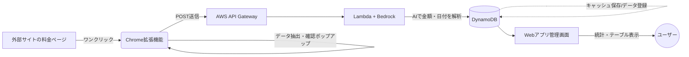

# サブスク＆固定費 管理ツール 要件定義書 (Ver 2.0)

## 📊 全体像と画面イメージ

### 1. システム連携フロー図

## 🎯 1. プロダクト概要
他サイトの料金ページからワンクリックで金額データを抽出し、一元管理できる家計簿型Webアプリ。「このサービスは1日あたりいくらか？」といった課金頻度ごとのコストを細かく可視化し、固定費の最適化を支援する。

## ✨ 2. コア機能

### 🌐 Webアプリ（フロントエンド）
* **頻度別・種別ダッシュボード:** 登録データを種別（回線、サブスク、機器代など）に分類し、一覧で管理する。
* **自動換算セル:** データ登録時、金額を「日あたり」「月あたり」「年あたり」に自動換算して各セルに表示し、細かく比較可能にする。
* **累計コスト算出:** 利用開始日（契約日）からの経過日数を計算し、現在までの「支払累計額」を可視化する。

### 🧩 Chrome拡張機能（抽出ツール）
* **ワンクリック抽出:** 他サイトの料金ページ上でボタンを押すだけで、必要なテキスト（金額・日付・タイトル等）を自動取得する（他サイトからのワンクリック表作成の補助機能として活用）。
* **ポップアップ確認:** 抽出したデータをブラウザ上でポップアップ表示。ユーザーが金額等を確認・修正した上でWebアプリへ送信・登録する。

## ⚙️ 3. バックエンド構成（AWSサーバーレス）
* **API Gateway + Lambda:** リクエスト受付、認証、およびビジネスロジックの実行。
* **Amazon DynamoDB:** Webアプリのデータ本番管理、およびAI解析結果の「URL/回答」ベースでのキャッシュ保存。
* **Amazon Bedrock:** テキストから金額・日付・サービス名をJSON形式で抽出。レスポンス速度を最優先し、Haiku等の軽量モデルを採用する（速度が出ない場合はモデルを即交代する）。

## 🛡️ 4. 非機能要件（コストと速度）
* **FinOps（AIコスト削減）:** 拡張機能からの無駄なリクエスト（金額と日付が必要なタイミング以外）を抑え、DynamoDBのキャッシュを最大限活用することで、BedrockのAPI呼び出し回数を極限まで減らす。
* **速度・UX:** AI解析時の待ち時間を最小化（数秒以内）。キャッシュヒット時は即座に結果を返す。
* **セキュリティ:** APIにスロットリング（レート制限）を設け、過剰リクエストによるシステムダウンや高額請求を防止する。